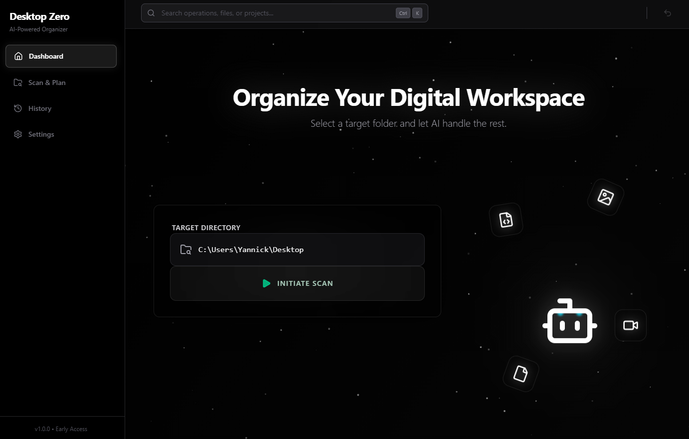
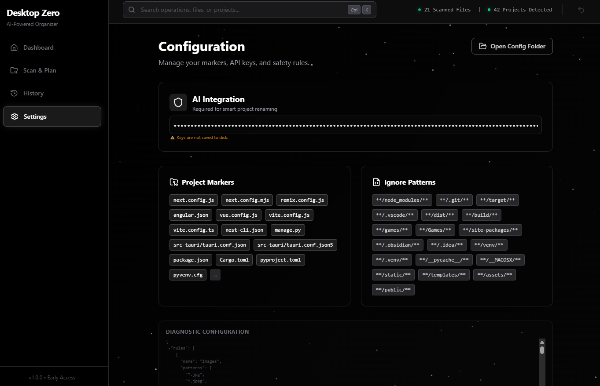

# Desktop Organizer

A powerful, AI-enhanced desktop file organizer built with Tauri, React, and Rust. Automatically organize your files into projects, categorize loose files, and keep your workspace clean with intelligent scanning and planning.



## ✨ Features

### 🤖 **AI-Powered Organization**
- **Smart Project Detection**: Automatically identifies projects using 50+ markers (package.json, Cargo.toml, pyproject.toml, etc.)
- **AI Project Renaming**: Uses OpenAI to generate meaningful project names based on README, package.json, and other context files
- **Intelligent Categorization**: Organizes files by type (Images, Videos, Documents, Archives, etc.)

### 🎯 **Advanced Scanning**
- **Recursive Directory Scanning**: Deep scan with smart ignore patterns (node_modules, .git, etc.)
- **Safety Heuristics**: Protects installed software, system folders, and Obsidian vaults
- **Framework Detection**: Prioritizes specific frameworks (Next.js, Django, Tauri) over generic markers
- **Real-time Progress**: Live stats showing scanned files and detected projects

### 📋 **Operation Planning**
- **Visual Operation Cards**: See exactly what will be moved before applying changes
- **Reason Indicators**: Each operation shows why it was planned (Project, Rule, Extension)
- **Individual Removal**: Hover over operations to remove unwanted moves with a red X icon
- **Collision Handling**: Smart renaming prevents file conflicts

### 🔄 **Undo & History**
- **Full Undo Support**: Revert entire batches of operations
- **Operation History**: Track all changes made in the current session
- **Transactional Moves**: All-or-nothing execution ensures data safety

### ⚙️ **Customizable Configuration**
- **Persistent Settings**: Config saved to app directory (survives across sessions)
- **Custom Rules**: Define your own file organization patterns
- **Ignore Patterns**: Exclude specific folders from scanning
- **Project Markers**: Add custom project detection files

### 🎨 **Modern UI**
- **Starry Glass Theme**: Beautiful dark theme with glassmorphism effects
- **Animated Background**: Dynamic particle system with floating stars
- **Green Server Glow**: Emerald accents for a tech-focused aesthetic
- **Responsive Design**: Smooth animations and hover effects

## 📸 Screenshots

### Overview Dashboard

*Hero section with scan controls and floating file type icons*

### Planned Operations

*Visual cards showing planned file moves with reasons and destinations*

### Settings & Configuration

*API key management and configuration preview*

## 🚀 Installation

### Prerequisites
- **Node.js** (v18 or higher)
- **Rust** (latest stable)
- **npm** or **yarn**

### Build from Source

1. **Clone the repository**
   ```bash
   git clone <repository-url>
   cd organizer-application
   ```

2. **Install dependencies**
   ```bash
   npm install
   ```

3. **Run in development mode**
   ```bash
   npm run tauri dev
   ```

4. **Build for production**
   ```bash
   npm run tauri build
   ```

   The installer will be created at:
   - **Windows**: `src-tauri/target/release/bundle/nsis/desktop-organizer_0.1.0_x64-setup.exe`
   - **macOS**: `src-tauri/target/release/bundle/dmg/`
   - **Linux**: `src-tauri/target/release/bundle/appimage/`

## 🛠️ Tech Stack

- **Frontend**: React 18 + TypeScript + Vite
- **Backend**: Rust + Tauri 2.0
- **Styling**: TailwindCSS + Framer Motion
- **Icons**: Lucide React
- **AI Integration**: OpenAI API (gpt-4o-mini)

## 📖 Usage

1. **Select Target Directory**: Enter the path to the folder you want to organize
2. **Start Scan**: Click "Initiate Scan" to analyze the directory
3. **Review Operations**: Check the planned moves in the Operations tab
4. **Apply Changes**: Click "Apply X Changes" to execute the plan
5. **Undo if Needed**: Use the Undo button in the History tab to revert changes

### AI Project Renaming (Optional)

1. Go to **Settings** tab
2. Enter your OpenAI API key (starts with `sk-`)
3. In the **Operations** tab, click **✨ AI Enhance**
4. The AI will analyze project contents and suggest better names

## ⚙️ Configuration

The config file is stored at:
- **Windows**: `%APPDATA%\com.deskorganizer.app\config.json`
- **macOS**: `~/Library/Application Support/com.deskorganizer.app/config.json`
- **Linux**: `~/.config/com.deskorganizer.app/config.json`

### Default Rules

- **Images**: `*.jpg`, `*.png`, `*.gif`, etc. → `Media/Images`
- **Videos**: `*.mp4`, `*.mkv`, `*.mov` → `Media/Videos`
- **Documents**: `*.pdf`, `*.docx`, `*.txt` → `Documents`
- **Archives**: `*.zip`, `*.rar`, `*.7z` → `Downloads/Archives`
- **Installers**: `*.exe`, `*.msi` → `Downloads/Installers`

### Project Markers

Supports 50+ project markers including:
- JavaScript/TypeScript: `package.json`, `next.config.js`, `vite.config.ts`
- Python: `pyproject.toml`, `requirements.txt`, `manage.py`
- Rust: `Cargo.toml`
- Go: `go.mod`
- Docker: `Dockerfile`, `docker-compose.yml`
- Unity: `ProjectSettings/`, `Assets/`
- And many more...

## 🔒 Safety Features

- **Installed Software Protection**: Detects and ignores program installations
- **System Folder Exclusion**: Skips critical OS directories
- **Obsidian Vault Protection**: Preserves `.obsidian` configuration
- **Smart Recursion**: Avoids scanning into protected project folders
- **Collision Prevention**: Automatically renames files to prevent overwrites

## 🤝 Contributing

Contributions are welcome! Please feel free to submit a Pull Request.

## 📝 License

This project is licensed under the MIT License.

## 🙏 Acknowledgments

- Built with [Tauri](https://tauri.app/)
- UI components inspired by modern design systems
- Icons by [Lucide](https://lucide.dev/)
